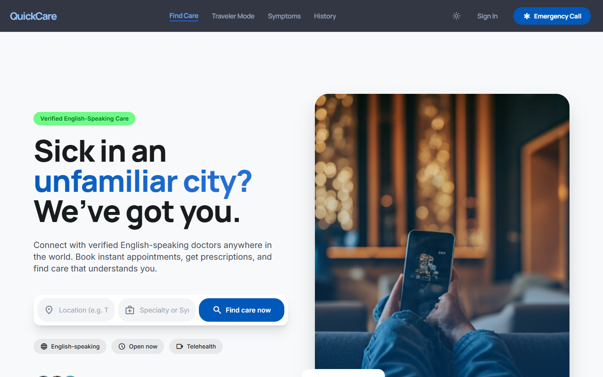
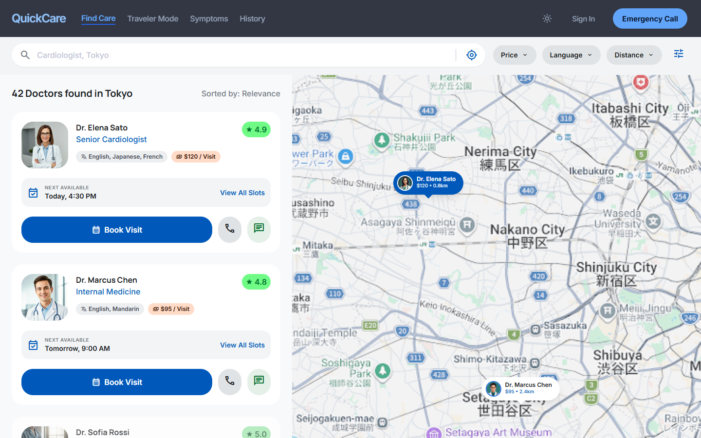
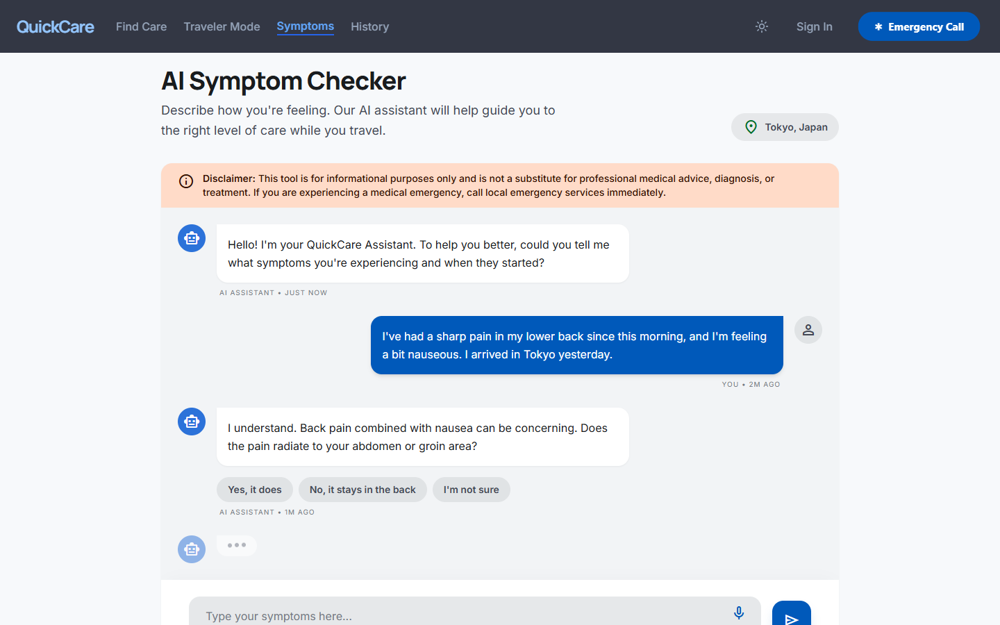

<div align="center">

# 🏥 QuickCare

**Trusted Healthcare for Travelers, Anywhere, Anytime**

[](https://quickcare-rto6.onrender.com/)
[](https://opensource.org/licenses/MIT)

<br/>

> *"How can travelers quickly access trusted, affordable healthcare in unfamiliar locations during urgent situations?"*

<br/>

QuickCare is a smart, traveler-focused healthcare platform that connects users with verified doctors, clinics, and pharmacies near their current location — in minutes. It eliminates the confusion, cost uncertainty, and language barriers that travelers face when seeking urgent medical attention in unfamiliar cities or countries.

---

## 📸 Platform Previews

### Landing Page


### Intelligent Doctor Search


### AI-Powered Symptom Checker


</div>

---

## 🚨 The Problem

Traveling to a new city or country is exciting — but falling ill during a trip is a nightmare. Travelers regularly face:

- 🔍 **No trusted recommendations** — Not knowing which hospitals or clinics are reputable and safe.
- 💬 **Language barriers** — Unable to communicate symptoms effectively with local healthcare providers.
- 💸 **Hidden costs** — No transparency on consultation fees or treatment costs before visiting.
- ⏱️ **Time loss** — Wasting precious hours searching for the right type of specialist.
- 😰 **High stress** — Making medical decisions in an unfamiliar environment during an emergency.

These challenges are especially severe for international travelers, elderly tourists, and solo adventurers navigating a foreign healthcare system.

---

## 💡 The Solution

**[Experience the live application here](https://quickcare-rto6.onrender.com/)**

QuickCare is a centralized, intelligent medical assistance platform that:

- Pinpoints **verified healthcare providers** based on a traveler's real-time location.
- Provides **full transparency** — fees, specialties, available languages, and live availability.
- Guides users through a **symptom-based triage system** to the most suitable type of specialist.
- Extends support to **pharmacy discovery and medicine comparison** to complete the care loop.

---

## ✨ Core Features

### 🗺️ Location-Based Provider Discovery
- Detect the user's current GPS location automatically.
- Display an interactive map view and list view of nearby verified hospitals, clinics, and independent doctors.
- Real-time availability status for each provider.

### ✅ Verified & Trusted Providers
- All healthcare providers are vetted and badge-verified on the platform.
- Patient ratings and reviews are displayed for transparency and trust.

### 🩺 AI Symptom-to-Specialist Triage
- Users describe their symptoms in plain language or select from common health concerns.
- AI-assisted logic recommends the most appropriate type of specialist, reducing decision fatigue in high-stress urgent situations.

### 🔎 Smart Filters
- **Distance** — Show providers within a selected radius.
- **Cost Range** — Filter by consultation fee budget.
- **Language** — Find doctors who speak the user's native language.

---

## 🛠️ Tech Stack

- **Frontend Engine**: React 19, Vite 8, React Router v7
- **Styling**: Tailwind CSS v3
- **Icons**: Lucide React
- **Deployment**: Render (Web Service)
- **Backend Architecture**: Node.js & Express (Configured to serve the static frontend app)

---

## 🚀 Getting Started Locally

### Prerequisites

Ensure you have the following installed:
- [Node.js](https://nodejs.org/) (v18 or above)
- [npm](https://www.npmjs.com/)
- [Git](https://git-scm.com/)

### Installation & Setup

```bash
# 1. Clone the repository
git clone https://github.com/daksh006v/Quickcare.git
cd Quickcare

# 2. Install frontend dependencies
cd frontend
npm install

# 3. Start the development server
npm run dev
```

The application will be available at `http://localhost:5173`.

---

## 🌐 Live Deployment

QuickCare is automatically deployed via Render. Every push to the `main` branch triggers a new production build.

**Live URL:** [https://quickcare-rto6.onrender.com/](https://quickcare-rto6.onrender.com/)

The deployment utilizes a *Coupled Architecture* where the Node.js backend serves the compiled Vite static assets and intercepts missing routes to allow `react-router-dom` to function properly.

---

## 🤝 Contributing

Contributions are welcome! Here's how you can help:

1. **Fork** the repository
2. **Create** a feature branch: `git checkout -b feature/your-feature-name`
3. **Commit** your changes: `git commit -m 'feat: add some feature'`
4. **Push** to the branch: `git push origin feature/your-feature-name`
5. **Open** a Pull Request

---

<div align="center">

**Built with ❤️ to make healthcare accessible for every traveler.**

*QuickCare — Find the Right Care, Right Now.*

</div>